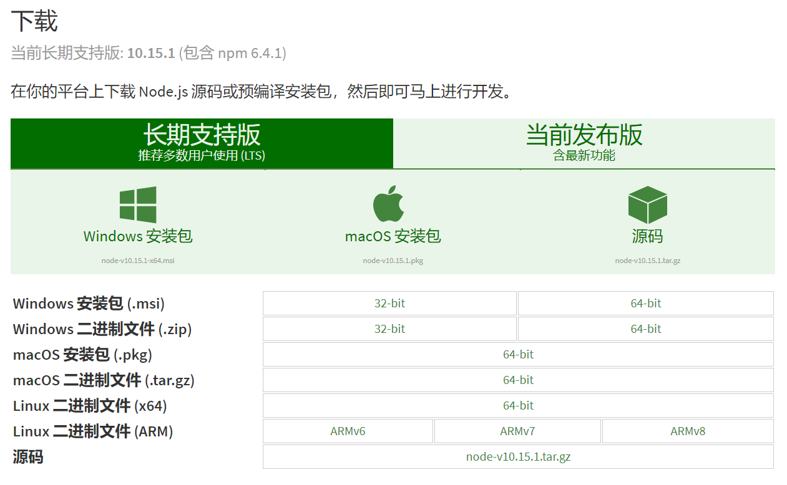
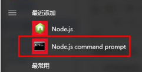

##毕业设计--“美味不用队”开发记录

###技术栈：
+ #### 前端：vue全家桶、mini-ui组件库、webpack
+ #### 后端：
  + ##### 服务端：node.js、express以及相关插件、模块
  + ##### 数据库：mongodb

#### 一、安装node
&emsp;&emsp;本项目是基于vue全家桶以及express，而它们项目搭建以来于node的npm包管理器，接下来先来搭建项目开发环境。
##### 1、安装node.js
&emsp;&emsp;下载地址：http://nodejs.cn/download/ 
  
安装完成后运行Node.js command prompt,```node -v```查看版本
  
现在新版本的node.js已经集成npm所以无需安装，```npm -v``` 查看版本，国内使用npm速度会比较慢，可以注册淘宝镜像cnpm来代替npm：
命令：```npm install cnpm -g --registry=https://registry.npm.taobao.org```
#### 二、安装vue脚手架vue-cli
命令：```cnpm install -g vue-cli```
#### 三、新建并cd到项目文件夹，初始化vue项目：
命令：```vue init webpack my-project```
按需数据下面信息：
+ 项目名：Project name 
+ 项目描述：Project description 
+ 作者：Author  
+ 是否需要ESlist语法检查：Use ESLint to lint your code?
+ 是否需要单元测：Setup unit tests with Karma + Mocha? 试 
+ 是否需要e2e测试 ：Setup e2e tests with Nightwatch? 
项目目录结构：
##### 目录结构
```js
-| build （用于存放webpack相关配置和脚本。开发偶尔使用 webpack.base.conf.js 。）
    -| build.js （生产构建环境）
    -| check-versions.js （检查版本）
    -| util.js （构建相关工具）
    -| vue-loader.conf.js （CSS加载器配置）
    -| webpack.base.conf.js （webpack基础配置）
    -| webpack.dev.conf.js （webpack开发环境配置）
    -| webpack.prod.conf.js （webpack生产环境配置）
-| config （主要存放配置文件，用于区分开发环境、线上环境的不同）
    -| dev.env.js （开发环境配置）
    -| index.js （项目主要配置，包括端口号、打包路径等）
    -| prod.env.js （生产环境配置）
-| dist （默认 npm run build 命令打包生成的静态资源文件，用于生产部署。）
-| node_modules （依赖包）
-| src （项目核心文件）
    -| assets （存放资源文件，css、js、images）
    -| components （公共组件）
    -| router （vue-router vue路由的配置文件）
    -| App.vue （使用标签<route-view></router-view>渲染整个工程的.vue组件）
    -| main.js （入口文件）
-| static （静态资源）
-| .babelrc （babel编译参数）
-| .editorconfig （代码格式）
-| .gitignore （git忽略上传的文件配置）
-| .postcssrc.js （转换CSS的工具）
-| index.html （主页，挂载#app节点）
-| package-lock.json（项目基本信息）
-| package.json （项目基本信息）
-| README.md （说明文件）
```